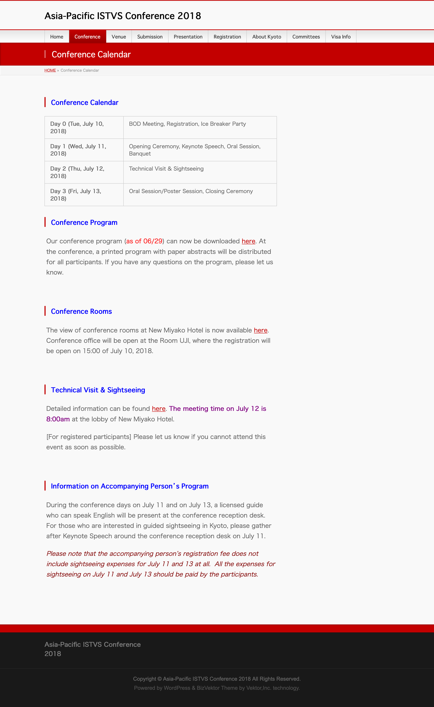

# Conference

#### **Conference Calendar**

| **Day 0 (Tue, July 10, 2018)** | BOD Meeting, Registration, Ice Breaker Party            |
| ------------------------------ | ------------------------------------------------------- |
| **Day 1 (Wed, July 11, 2018)** | Opening Ceremony, Keynote Speech, Oral Session, Banquet |
| **Day 2 (Thu, July 12, 2018)** | Technical Visit & Sightseeing                           |
| **Day 3 (Fri, July 13, 2018)** | Oral Session/Poster Session, Closing Ceremony           |

#### Conference Program

Our conference program (as of 06/29) can now be downloaded here:



At the conference, a printed program with paper abstracts will be distributed for all participants. If you have any questions on the program, please let us know.

#### Conference Rooms

The view of conference rooms at New Miyako Hotel is now available here:



Conference office will be open at the Room UJI, where the registration will be open on 15:00 of July 10, 2018.

#### Technical Visit & Sightseeing

**The meeting time on July 12 is 8:00am** at the lobby of New Miyako Hotel. Detailed information can be found here:



\[For registered participants] Please let us know if you cannot attend this event as soon as possible.

#### Information on Accompanying Person’s Program

During the conference days on July 11 and on July 13, a licensed guide who can speak English will be present at the conference reception desk. For those who are interested in guided sightseeing in Kyoto, please gather after Keynote Speech around the conference reception desk on July 11.

_Please note that the accompanying person’s registration fee does not include sightseeing expenses for July 11 and 13 at all.  All the expenses for sightseeing on July 11 and July 13 should be paid by the participants._

<figure><figcaption></figcaption></figure>
