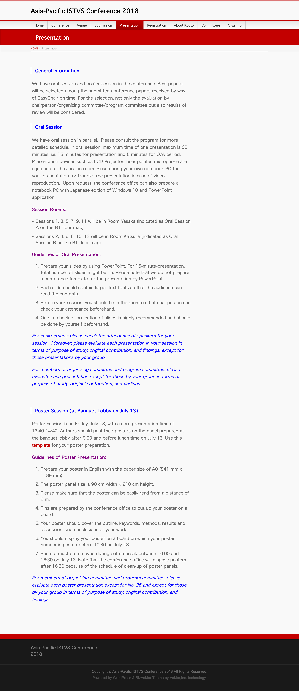

# Presentation

#### General Information

We have oral session and poster session in the conference. Best papers will be selected among the submitted conference papers received by way of EasyChair on time. For the selection, not only the evaluation by chairperson/organizing committee/program committee but also results of review will be considered.

#### Oral Session

We have oral session in parallel.  Please consult the program for more detailed schedule. In oral session, maximum time of one presentation is 20 minutes, i.e. 15 minutes for presentation and 5 minutes for Q/A period. Presentation devices such as LCD Projector, laser pointer, microphone are equipped at the session room. Please bring your own notebook PC for your presentation for trouble-free presentation in case of video reproduction.  Upon request, the conference office can also prepare a notebook PC with Japanese edition of Windows 10 and PowerPoint application.

**Session Rooms:**

* Sessions 1, 3, 5, 7, 9, 11 will be in Room Yasaka (indicated as Oral Session A on the B1 floor map)
* Sessions 2, 4, 6, 8, 10, 12 will be in Room Katsura (indicated as Oral Session B on the B1 floor map)

**Guidelines of Oral Presentation:**

1. Prepare your slides by using PowerPoint. For 15-mitute-presentation, total number of slides might be 15. Please note that we do not prepare a conference template for the presentation by PowerPoint.
2. Each slide should contain larger text fonts so that the audience can read the contents.
3. Before your session, you should be in the room so that chairperson can check your attendance beforehand.
4. On-site check of projection of slides is highly recommended and should be done by yourself beforehand.

_For chairpersons: please check the attendance of speakers for your session.  Moreover, please evaluate each presentation in your session in terms of purpose of study, original contribution, and findings, except for those presentations by your group._

_For members of organizing committee and program committee: please evaluate each presentation except for those by your group in terms of purpose of study, original contribution, and findings._

#### Poster Session (at Banquet Lobby on July 13)

Poster session is on Friday, July 13, with a core presentation time at 13:40-14:40. Authors should post their posters on the panel prepared at the banquet lobby after 9:00 and before lunch time on July 13. Use this template for your poster preparation.



**Guidelines of Poster Presentation:**

1. Prepare your poster in English with the paper size of A0 (841 mm x 1189 mm).
2. The poster panel size is 90 cm width × 210 cm height.
3. Please make sure that the poster can be easily read from a distance of 2 m.
4. Pins are prepared by the conference office to put up your poster on a board.
5. Your poster should cover the outline, keywords, methods, results and discussion, and conclusions of your work.
6. You should display your poster on a board on which your poster number is posted before 10:30 on July 13.
7. Posters must be removed during coffee break between 16:00 and 16:30 on July 13. Note that the conference office will dispose posters after 16:30 because of the schedule of clean-up of poster panels.

_For members of organizing committee and program committee: please evaluate each poster presentation except for No. 26 and except for those by your group in terms of purpose of study, original contribution, and findings._

<figure><figcaption></figcaption></figure>
