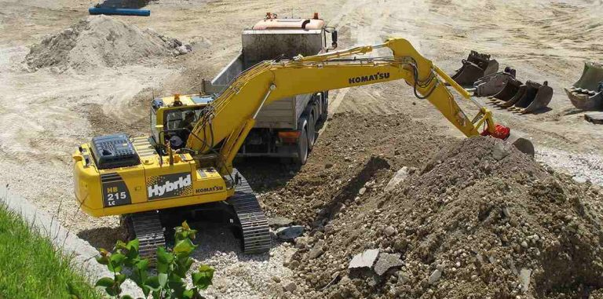

# Submission

#### **Submission of Abstract/Conference Paper**

The conference paper should be prepared by the following schedule.

| ~~Abstract Due~~               | ~~January 25, 2018~~  |
| ------------------------------ | --------------------- |
| ~~Full Paper Due~~             | ~~March 1, 2018~~     |
| **Report of Review Result**    | **May 14, 2018**      |
| **Final Conference Paper Due** | **June 8, 2018**      |

#### ~~**Submission of Abstract**~~

Abstract submission is closed as of January 25, 2018.

#### **Report of Review Result**

Since some reports from reviewers are not yet reached to the office of Program Committee, the schedule of report of review result to authors is now delayed. Results of reviewing are expected to be sent to all authors by May 14.

#### Submission of Final Conference Paper

The resubmitted paper will be included in the conference proceedings as it is, and so please make sure to strictly follow the guidelines and instructions for preparing your manuscript. We highly recommend that you use the full paper template which can be downloaded from EasyChair system.

To resubmit your final paper:

* Please log into [EasyChair](https://easychair.org/) with your user name and password to access your account.
* Click on “Update file” on your submission page and upload your final paper. Your submission page can be found in the top menu with your paper number.
* The final paper must be strictly followed the instructions for manuscript preparation. The instructions and template format can be downloaded from “templates” appeared in the top menu of your EasyChair account.

The deadline for the resubmission of the final conference paper is **June 8, 2018**.

Please note the followings:

* Late resubmission after **June 9 (0:00 JST)** cannot be accepted because of our conference preparation.
* Papers not following the format instructions, and/or those with inadequate revision, and/or those without using the template may not be included in the conference proceeding.
* **If there is no registration record in our conference system, we will not include your final paper in our proceedings nor in our conference program.**

#### **Conference Sessions**

Following sessions are planned:

* Terramechanics, terrain/soil-wheel/tire/track interaction, modeling and characterization
* Advances in mobility, energy transfer, efficiency, ground vehicle dynamics, safety
* Land locomotion, off-road vehicles, operation snow and ice
* Agricultural, forestry, construction and mining equipment and vehicles
* Mobile robotics for ground applications, planetary and exploration, other environments
* Innovative system designs for terrain and road-vehicle applications
* Application of bionics engineering to terramechanics

Not only oral session but also poster session will be available in the conference. Please select your preferred session at the time of abstract submission. The language at the conference is English.

Best papers will be selected from all full papers submitted to the conference.  A full paper with no registration record will be excluded from our conference proceedings and from the selection of best conference papers.

.png>)
