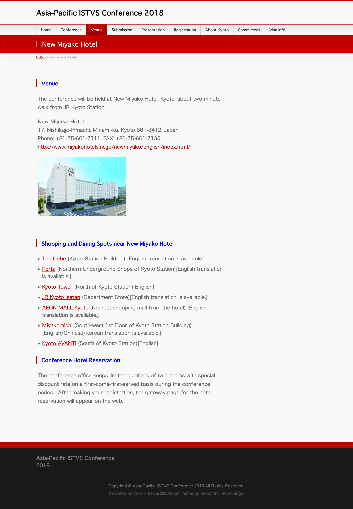

# Venue

**Venue**

The conference will be held at New Miyako Hotel, Kyoto, about two-minute-walk from JR Kyoto Station.

**New Miyako Hotel**\
17, Nishikujo-Inmachi, Minami-ku, Kyoto 601-8412, Japan\
Phone: +81-75-661-7111; FAX: +81-75-661-7135\
[http://www.miyakohotels.ne.jp/newmiyako/english/index.html/](http://www.miyakohotels.ne.jp/newmiyako/english/index.html/)

#### Shopping and Dining Spots near New Miyako Hotel

* [The Cube](http://en.thecube.jp) (Kyoto Station Building) \[English translation is available.]
* [Porta](http://www.porta.co.jp) (Northern Underground Shops of Kyoto Station)\[English translation is available.]
* [Kyoto Tower](https://www.keihanhotels-resorts.co.jp/kyoto-tower/en/) (North of Kyoto Station)\[English]
* [JR Kyoto Isetan](http://kyoto.wjr-isetan.co.jp/index.html) (Department Store)\[English translation is available.]
* [AEON MALL Kyoto](http://kyoto-aeonmall.com) (Nearest shopping mall from the hotel) \[English translation is available.]
* [Miyakomichi](http://www.gnavi.co.jp/kinmei/english\_site/index.html) (South-west 1st Floor of Kyoto Station Building) \[English/Chinese/Korean translation is available.]
* [Kyoto AVANTI](http://kyoto-avanti.com/language/) (South of Kyoto Station)\[English]

#### Conference Hotel Reservation

The conference office keeps limited numbers of twin rooms with special discount rate on a first-come-first-served basis during the conference period.  After making your registration, the gateway page for the hotel reservation will appear on the web.

<figure><figcaption></figcaption></figure>
